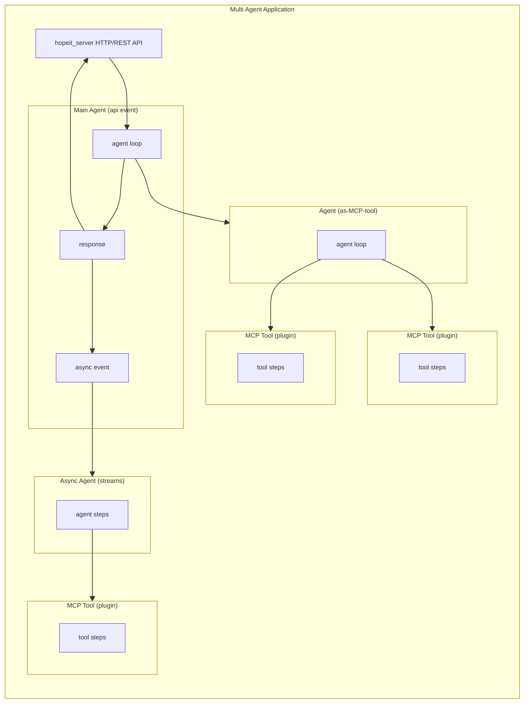
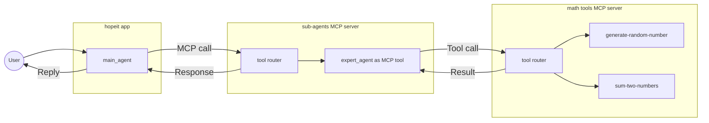

# hopeit.agents

### Agentic framework with MCP and async agent-to-agent communication support


## Overview

**hopeit.agents** provides plugins and libraries to build and run straightforward multi-agent systems, expose agents using http endpoints, use and serve Model Context Protocol (MCP) tools, provide agent-as-a-tool support for sync agent-to-agent communication and manage asynchrounous message and job submissions between agents.

This project builds on [hopeit.engine](https://github.com/hopeit-git/hopeit.engine) to take advange of its building blocks: Apps that serve events and communicate sychronously via http or asynchronously using streams, and plugins to support common functionallity.



**hopeit.agents** provides reusable plugins and examples so hopeit applications can expose MCP tools and agent-as-tools, call external tools, and bridge MCP-enabled agents and tools with non-agentic services over HTTP. In addition to MCP, hopeit.engine already provide ways to use asynchronous events (using streams) to send messages and submit jobs between agents when a sync MCP call is not needed.

### Core plugins
- `plugins/mcp/mcp-server`: serve hopeit events (Python modules that define the behavior on each call) as MCP tools so any agent using MCP client can invoke them.
- `plugins/agents/model-client`: connect agents to LLM providers when issuing tool calls or generating responses.
- `plugins/mcp/mcp-client`: client used by the agents to connect to MCP servers.

### Example projects

As an example/test in this repo, there are a few **hopeit** applications and tools provided to showcase how to build a multi-agent system:

- `examples/plugins/example-tool`: sample MCP tools ("generate-random-number" and "sum-two-numbers") exposed through the MCP server.
- `examples/apps/example-agents`: two cooperating agents. The `expert_agent` uses the sample tools to fill missing values and solve sum expressions, and is itself exposed as an MCP tool that the `main_agent` invokes to answer user prompts. `main_agent` remains a standard hopeit.event with HTTP/REST endpoints for client interaction.



## Running the MCP Example Stack

### Setup dev environment
```bash
make install-dev
```

### Configure model environment variables
```bash
export AGENT_MODEL_API_BASE="http://localhost:11434/v1"
export AGENT_MODEL_NAME="gpt-oss:20b"
export AGENT_DEPLOYMENT_NAME=""
export AGENT_API_VERSION=""
```
The default API base expects a local Ollama server exposing the model declared in `AGENT_MODEL_NAME`. Update these values to match your LLM provider if you are not running Ollama on `http://localhost:11434/v1`.

### Launch sub-agents MCP server
```bash
uv run --no-sync hopeit_mcp_server run \
  --host 127.0.0.1 \
  --port 8767 \
  --config-files plugins/mcp/mcp-server/config/dev-noauth.json,plugins/mcp/mcp-server/config/plugin-config.json,examples/apps/example-agents/config/app-config.json \
  --enabled-groups sub-agents
```
This server exposes the sub-agent MCP endpoint at `http://127.0.0.1:8767/mcp`.

### Launch example agents app
```bash
uv run --no-sync hopeit_server run \
  --host 127.0.0.1 \
  --port 8020 \
  --config-files examples/apps/example-agents/config/dev-noauth.json,plugins/mcp/mcp-client/config/plugin-config.json,plugins/agents/model-client/config/plugin-config.json,examples/apps/example-agents/config/app-config.json \
  --api-auto "AgentExample;AgentExample;1.0"
```
The application forwards MCP calls to the sub-agents server and publishes OpenAPI docs at `http://127.0.0.1:8020/api/docs` for manual HTTP testing.

### Launch MCP server with example tools
```bash
uv run --no-sync hopeit_mcp_server run \
  --host 127.0.0.1 \
  --port 8765 \
  --config-files plugins/mcp/mcp-server/config/dev-noauth.json,plugins/mcp/mcp-server/config/plugin-config.json,examples/plugins/example-tool/config/plugin-config.json
```
The MCP server exposes the Model Context Protocol endpoint at `http://127.0.0.1:8765/mcp`.

### Launch MCP client (hopeit app)
```bash
uv run --no-sync hopeit_server run \
  --host 127.0.0.1 \
  --port 8766 \
  --config-files plugins/mcp/mcp-server/config/dev-noauth.json,plugins/mcp/mcp-client/config/plugin-config.json \
  --api-auto "mcp_client;mcp_client;1.0"
```
Once running, explore `http://127.0.0.1:8766/api/docs` to trigger tool invocations or craft HTTP calls that exercise the MCP tools exposed by the server at `http://127.0.0.1:8765/mcp`.


Make a sample call to the main agent:
```bash
curl -X POST "http://localhost:8020/api/hopeit-agents-example-agents/0x1/agents/main-agent" \
 -H 'accept: application/json'\
 -H 'content-type: application/json' \
 -d '{"agent_id":"agent_123","user_message":"Solve the expression x + y where x and y are random numbers between 0 and 100","conversation":{"messages":[],"agent_id":"agent_123","session_id":"session_123","created_at":"2025-01-01T00:00:00.000Z"},"metadata":{}}' 
```

Answer should be something like this:

```markdown
  **Result of the expression `x + y`**
  
  The expert‑agent evaluated the expression using random values:
  
  | Tool called            | Input                         | Output |
  |------------------------|-------------------------------|--------|
  | `tool-generate-random` | `{range: {min: 0, max: 100}}` |  `89`  |
  | `tool-generate-random` | `{range: {min: 0, max: 100}}` |  `82`  |
  | `tool-sum-two-numbers` | `{a: 89, b: 82}`              | `171`  |
  
  So, the computed value of **x + y** is **171**.
```

Which means:

1. The main agent took the user request and decided to call the expert-agent with the expression "x + y"
2. The expert-agent used the tools to generate 2 random numbers for x and y and perform the sum
3. The expert-agent returned the result and a list of tool calls used
4. The main agent summarized the result for the user


Full response:
```json
{
  "agent_id": "agent_123",
  "conversation": {
    "messages": [
      {
        "role": "system",
        "content": "You are a helpful agent that can solve simple math expression by using an expert-agent tool. You need to take the user input, converted into an expression using letters and numbers for example  (x - 200) + (y + 300) and submit the expression to the expert_agent tool. DON'T use or provide answers with numbers that are not coming from the tools. Show the result of the tool to the user, plus a summary of a list of tool calls returned form the expert.\n\nYou can call ONLY the following tools when needed. Return tool calls with JSON that follow the schema.agents-expert-agent: Aggregated agent response\n  JSON schema: {\"description\": \"Incoming agent instruction.\", \"properties\": {\"agent_id\": {\"title\": \"Agent Id\",\"type\": \"string\"},\"metadata\": {\"additionalProperties\": true,\"title\": \"Metadata\",\"type\": \"object\"},\"user_message\": {\"title\": \"User Message\",\"type\": \"string\"}   }, \"required\": [   \"agent_id\",\"user_message\"   ], \"title\": \"ExpertAgentRequest\", \"type\": \"object\" }",
        "tool_call_id": null,
        "name": null,
        "tool_calls": null,
        "metadata": {}
      },
      {
        "role": "user",
        "content": "Solve the expression x + y where x and y are random numbers between 0 and 100",
        "tool_call_id": null,
        "name": null,
        "tool_calls": null,
        "metadata": {}
      },
      {
        "role": "assistant",
        "content": "",
        "tool_call_id": null,
        "name": null,
        "tool_calls": [
          {
            "id": "call_cf957ceaf0",
            "type": "function",
            "function": {
              "name": "agents-expert-agent",
              "arguments": "{\"agent_id\":\"expert\",\"metadata\":{},\"user_message\":\"x + y\"}"
            }
          }
        ],
        "metadata": {}
      },
      {
        "role": "tool",
        "content": "{\n\"agent_id\": \"expert\",\n\"results\": {\"expr_values\": [{\"expr\": \"x + y\",\"value\": 171} ]\n  },\n\"error\": null,\n\"assistant_message\": null,\n\"tool_calls\": [{\"request\": {\"tool_call_id\": \"call_bbac5baf82\",\"tool_name\": \"tool-generate-random\",\"payload\": {\"range\": {\"max\": 100,\"min\": 0}  }}, \"response\": {\"call_id\": \"call_bbac5baf82\",\"tool_name\": \"tool-generate-random\",\"status\": \"success\",\"content\": [{\"type\": \"text\",\"text\": \"{\\n\\\"result\\\": {\ \\\"value\\\": 89\\n  }\\n}\",\"annotations\": null,\"meta\": null}     ],\"structured_content\": {\"result\": {\"value\": 89}  },\"error_message\": null,\"raw_result\": {\"meta\": null,\"content\": [{\"type\": \"text\",  \"text\": \"{\\n\\\"result\\\": {\ \\\"value\\\": 89\\n  }\\n}\",  \"annotations\": null,  \"meta\": null  }],\"structuredContent\": {\"result\": {\"value\": 89  }},\"isError\": false  },\"session_id\": \"expert\"} }, {\"request\": {\"tool_call_id\": \"call_0a5f93035b\",\"tool_name\": \"tool-generate-random\",\"payload\": {\"range\": {\"max\": 100,\"min\": 0}  }}, \"response\": {\"call_id\": \"call_0a5f93035b\",\"tool_name\": \"tool-generate-random\",\"status\": \"success\",\"content\": [{\"type\": \"text\",\"text\": \"{\\n\\\"result\\\": {\ \\\"value\\\": 82\\n  }\\n}\",\"annotations\": null,\"meta\": null}     ],\"structured_content\": {\"result\": {\"value\": 82}  },\"error_message\": null,\"raw_result\": {\"meta\": null,\"content\": [  {\"type\": \"text\",  \"text\": \"{\\n\\\"result\\\": {\ \\\"value\\\": 82\\n  }\\n}\",  \"annotations\": null,  \"meta\": null  }],\"structuredContent\": {\"result\": {\"value\": 82  }},\"isError\": false  },\"session_id\": \"expert\"} }, {\"request\": {\"tool_call_id\": \"call_26a9ece5c3\",\"tool_name\": \"tool-sum-two-numbers\",\"payload\": {\"a\": 89,\"b\": 82  }}, \"response\": {\"call_id\": \"call_26a9ece5c3\",\"tool_name\": \"tool-sum-two-numbers\",\"status\": \"success\",\"content\": [{\"type\": \"text\",\"text\": \"{\\n\\\"result\\\": 171\\n}\",\"annotations\": null,\"meta\": null}     ],\"structured_content\": {\"result\": 171  },\"error_message\": null,\"raw_result\": {\"meta\": null,\"content\": [  {\"type\": \"text\",  \"text\": \"{\\n\\\"result\\\": 171\\n}\",  \"annotations\": null,  \"meta\": null  }],\"structuredContent\": {\"result\": 171},\"isError\": false  },\"session_id\": \"expert\"} }\n  ]\n}",
        "tool_call_id": "call_cf957ceaf0",
        "name": "agents-expert-agent",
        "tool_calls": null,
        "metadata": {}
      },
      {
        "role": "assistant",
        "content": "**Result of the expression `x + y`**\n\nThe expert‑agent evaluated the expression using random values:\n\n| Tool called | Input | Output |\n|-------------|-------|--------|\n| `tool-generate-random` | `{range: {min: 0, max: 100}}` | `89` |\n| `tool-generate-random` | `{range: {min: 0, max: 100}}` | `82` |\n| `tool-sum-two-numbers` | `{a: 89, b: 82}` | `171` |\n\nSo, the computed value of **x + y** is **171**.",
        "tool_call_id": null,
        "name": null,
        "tool_calls": null,
        "metadata": {}
      }
    ],
    "agent_id": null,
    "session_id": null,
    "created_at": "2025-09-27T09:58:29.860628Z"
  },
  "assistant_message": {
    "role": "assistant",
    "content": "**Result of the expression `x + y`**\n\nThe expert‑agent evaluated the expression using random values:\n\n| Tool called | Input | Output |\n|-------------|-------|--------|\n| `tool-generate-random` | `{range: {min: 0, max: 100}}` | `89` |\n| `tool-generate-random` | `{range: {min: 0, max: 100}}` | `82` |\n| `tool-sum-two-numbers` | `{a: 89, b: 82}` | `171` |\n\nSo, the computed value of **x + y** is **171**.",
    "tool_call_id": null,
    "name": null,
    "tool_calls": null,
    "metadata": {}
  },
  "tool_calls": []
}
```