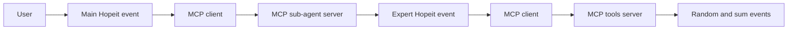
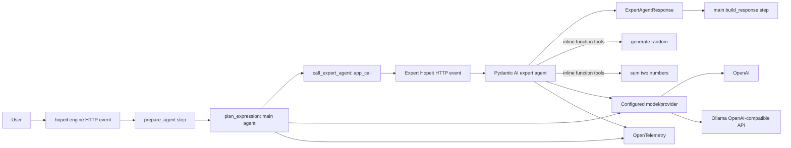

# hopeit.agents Examples Migration to hopeit.engine + Pydantic AI

> Status: completed. Legacy projects were kept read-only during the behavioral cutover and
> removed after the new application, dependency graph, tests, documentation, and Docker runtime
> were verified.

## TL;DR

Convert the active examples in this repository in place to a single `hopeit.engine`
application using Pydantic AI agents, typed outputs, and function tools. Remove all
MCP hops from the example execution path and stop using the existing `hopeit.agents` plugins.
Keep those plugin source directories read-only during the behavioral cutover, exclude them from
the active workspace, then remove them in the final cleanup.

Add one deliberately small common project at `plugins/agents/`, published as `hopeit-agents`,
only for Hopeit-specific integration that is genuinely shared by examples and applications.
Pydantic AI already provides messages, message-history serialization, tool-call
messages, tool schemas, dependency injection, toolsets, structured outputs, usage, conversation
correlation, testing models, and OpenTelemetry tracing; the new project must use those APIs rather
than duplicate them. Its initial justified surface is the config-driven model factory supporting
both OpenAI and Ollama, plus small Hopeit API/storage envelopes if they are actually consumed.

The resulting active example should demonstrate:

- `hopeit.engine` for HTTP events, settings, event steps, application context, and optional
  persistence/app-to-app calls.
- Pydantic AI for model/provider integration, the agent loop, typed outputs, inline tools,
  message history, usage, and tracing.
- A main agent delegating a sum-expression task to an expert agent without MCP.
- An expert agent using inline random-number and addition tools without an MCP server.
- OpenAI and local Ollama selected through the same `agent_model` configuration contract, with no
  provider branches in agent or tool code.

Naming rule: application/plugin settings, modules, packages, classes, and public dataobjects use
the `hopeit-agents` / `hopeit_agents` vocabulary. Do not create names with `pydantic_ai` or
`pydantic-ai` prefixes. The third-party dependency name and its required Python import path are
the unavoidable exceptions.

## Design Boundary

The migration uses this ownership boundary:

| Concern | Owner |
|---|---|
| HTTP/API events, settings, event steps, deployment, application calls, storage | `hopeit.engine` |
| Model calls, agent loop, tool calls, typed output, history, usage | Pydantic AI |
| Business operations | Plain Python functions or Hopeit events, wrapped as Pydantic AI tools |
| Cross-application calls | `hopeit.app.client.app_call`, only when there is a real application boundary |

Three repository-specific decisions follow from that boundary:

1. These are examples, not a live application migration. A parallel `example-agents2` package
   would leave two competing reference architectures and prolong use of the deprecated plugins.
   Migrate the active example in place, with changes split into reviewable PRs.
2. The random and addition operations are tiny and have no independent deployment requirement.
   They should be inline Pydantic AI tools in the agent app. Do not preserve their MCP network
   boundary merely to reproduce the old topology.
3. This repo currently has no conversation API or persistence contract to preserve. Add only the
   minimal conversation support needed to demonstrate multi-turn execution; do not introduce a
   generic framework before a real API requires it.

During the behavioral cutover, the existing plugins are treated as read-only legacy code. After
the migrated application passes independently, final cleanup removes their source, dependency
metadata, tests, and operational assets.

Neutral copies of `Message`, `Conversation`, and tool-call objects are not the preferred starting
point. Pydantic AI 2.9 already has model-independent message dataclasses and
`ModelMessagesTypeAdapter`. Persist that format directly and define small, application-owned
Hopeit DTOs only at HTTP boundaries.

## Pre-migration Repository Findings

Before migration, the default workspace installed and tested all of these libraries:

- `plugins/agents/agent-toolkit`
- `plugins/agents/model-client`
- `plugins/agents/skills`
- `plugins/mcp/mcp-client`
- `plugins/mcp/mcp-server`

The active example is split across:

- `examples/apps/example-agents`: main and expert agents.
- `examples/plugins/example-tool`: random and sum operations exposed through `__mcp__`.
- `examples/plugins/example-skills`: duplicate random and sum operations exposed through
  `__skill__`.

The current request path is unnecessarily indirect:



It also maintains two custom agent loops, a provider client, OpenAI-shaped messages, MCP
request/response records, and a separate skill registry. These are all responsibilities now
provided more completely by Pydantic AI.

## Target Architecture



There is one example application containing two independently addressable agent events and no MCP
process. Agent-to-agent hand-off is explicit in the main event's sequential Hopeit `__steps__`
workflow. The main event invokes the expert event through `hopeit.app.client.app_call`, preserving
the application boundary instead of importing or constructing the expert agent.

### Proposed active example layout

```text
examples/apps/example-agents/
  config/
    agents/
      main-agent-prompt.md
      expert-agent-prompt.md
    app-config.json
    dev-noauth.json
  src/hopeit_agents/example_agents/
    agents/
      main_agent.py
      expert_agent.py
    tools/
      math.py
      random.py
    models.py
  test/
```

Shared model construction and optional conversation helpers should be imported from the new
`hopeit-agents` project. Keep example-specific agents, prompts, tool implementations, and response
projections inside the example app.

## Replacement Matrix

| Current component | Pydantic AI / Hopeit replacement | Migration result |
|---|---|---|
| `model-client` | Pydantic AI `Model` implementations/providers | Deprecated; no active import |
| `agent-toolkit` loop | `Agent.run()` / `Agent.run_stream()` | Deprecated; no active import |
| `model_client.models.Message` and `Conversation` | `ModelMessage`, `ModelRequest`, `ModelResponse`, result message methods | Do not copy into a new runtime model |
| `model_client.conversation.build_conversation` | `instructions`, user prompt, `message_history` | Delete from active path |
| MCP tool discovery and invocation | Typed functions registered as Pydantic AI tools | No MCP transport in examples |
| `event_tool_api` / `__mcp__` | Function signature, docstring, and Pydantic validation | Remove from migrated code |
| `skills` registry and loop | Direct typed function tools | Remove the duplicate skills flow |
| `ToolCallRecord` / `SkillCallRecord` | Pydantic AI request/response message parts plus OTel spans | Derive a view only if an API needs it |
| prompt-generated JSON schemas | `output_type=ExpertAgentResults` | Typed validation and retries |
| manual iteration limits | Pydantic AI `UsageLimits(request_limit=...)` | Explicit run limit |
| custom provider client settings | `hopeit-agents` model settings/factory | Provider changes stay in config |
| MCP agent-to-agent call | Hopeit apps-client call between independent agent events | Default example path |
| agent event boundary | `hopeit.app.client.app_call` | Main-to-expert example path |

## Shared Plugin Decision

### Decision for this migration: add one thin `hopeit-agents` plugin

As of Pydantic AI 2.9.0, the candidate abstractions are already available:

- Conversation messages and manipulation: Pydantic AI message dataclasses, `all_messages()`,
  `new_messages()`, and history processors.
- Persistence format: `all_messages_json()` and `ModelMessagesTypeAdapter` for JSON round trips.
- Untrusted client history: `sanitize_messages()` before passing history into an agent.
- Conversation and trace correlation: `conversation_id` on runs/messages and the
  `gen_ai.conversation.id` OpenTelemetry attribute.
- Tool-call records: `ToolCallPart`, `ToolReturnPart`, and related model message parts.
- Tool grouping/reuse: `FunctionToolset` and the native toolset composition wrappers.
- Tracing and usage: Pydantic AI OpenTelemetry instrumentation and result usage.
- Long-running reliability: Pydantic AI durable-execution integrations exist, although they are
  out of scope for these examples.

Pydantic AI intentionally does not define Hopeit settings/dataobjects or choose a Hopeit storage
plugin. A thin integration project is justified because the same configuration-driven provider
construction and Hopeit boundary types can be consumed by multiple applications without
rebuilding an agent framework.

### Location, distribution, and import naming

Make `plugins/agents/` the root of the new project during cutover. The legacy child directories
shown below remain read-only until the final cleanup:

```text
plugins/agents/
  pyproject.toml                     # project.name = "hopeit-agents"
  README.md                          # documents only the new project
  src/hopeit_agents/
    agent_model.py                   # settings and OpenAI/Ollama factory
    api.py                           # optional shared Hopeit API envelopes
    conversations.py                 # optional storage envelope/repository protocol
    observability.py                 # optional Hopeit-to-OTel context bridge
    py.typed
  test/
    test_agent_model.py
    test_conversations.py
  agent-toolkit/                     # removed during final cleanup
  model-client/                      # removed during final cleanup
  skills/                            # removed during final cleanup
```

The distribution is `hopeit-agents` and its Python namespace is `hopeit_agents`. Do not name the
project, modules, config keys, settings classes, or public DTOs after the underlying agent library.
Imports from the third-party `pydantic_ai` package remain necessary inside the implementation.
Keep `hopeit_agents` as the repository's existing PEP 420 namespace package: do not add
`src/hopeit_agents/__init__.py`, and restrict new-project package discovery to
`plugins/agents/src` so the legacy child projects are not collected into the new distribution.

### Initial allowed surface

The new plugin should initially contain:

1. `AgentModelSettings` and `build_agent_model()` supporting `provider = "openai"` and
   `provider = "ollama"`.
2. Small Hopeit request/response or stored-conversation envelopes only when the migrated example
   consumes them.
3. A storage repository protocol or observability helper only when implemented and tested by the
   example. Empty speculative modules should not be added.

Keep these concerns application-owned:

- Domain-specific API request/response fields and public schemas.
- Authorization and tenant ownership of conversations.
- The storage key/index scheme and retention policy.
- Projection of rich Pydantic AI messages into a simplified UI chat format, if needed.
- Agent definitions, instructions, business tools, and provider-independent run orchestration.

### Excluded surface

The plugin must not wrap or fork `Agent`, create another agent loop, copy Pydantic AI message
classes, invent another tool/skill registry, or create provider-specific completion DTOs. It must
not depend on the deprecated `hopeit-agents.*` distributions. Every shared type/helper needs an
active consumer and tests; otherwise keep it in the example or omit it.

## Detailed Migration Plan

### Phase 0: Freeze behavior and establish baselines

1. Record the two flows that must remain:
   - Main agent receives a natural-language sum-expression request.
   - Expert agent substitutes random integers and calls addition.
2. Keep deterministic unit tests for random generation and addition.
3. Add an agent-level golden test using a Pydantic AI `TestModel` or `FunctionModel`; do not make
   default tests depend on Ollama, OpenAI, or network access.
4. Capture the existing Hopeit event names so API changes are intentional:
   - `agents.main_agent`
   - `agents.expert_agent`
5. Treat current verbose MCP-shaped response JSON as an implementation artifact, not a contract.
   Preserve the useful concepts—output, conversation ID/history, errors, and optional usage—not
   the nested MCP wire representation.

### Phase 1: Replace workspace dependencies

1. Create the new project at `plugins/agents/pyproject.toml` with project name `hopeit-agents` and
   add it to the root source/workspace configuration.
2. Add `pydantic-ai>=2.9,<3` (or `pydantic-ai-slim[openai]>=2.9,<3`) to the new project. The
   installed Ollama implementation uses the OpenAI-compatible client, so the `openai` extra
   supports both providers.
3. Add `hopeit-agents` and a direct Pydantic AI dependency to
   `examples/apps/example-agents/pyproject.toml`; the app imports the runtime API directly and
   should not rely on an undeclared transitive dependency.
4. Keep the repository's current supported `hopeit.engine` line initially. Do not combine the
   agent migration with an unrelated engine upgrade unless an API required by the implementation
   is missing.
5. Remove these dependencies from the active example:
   - `hopeit-agents.agent-toolkit`
   - `hopeit-agents.model-client`
   - `hopeit-agents.mcp-client`
   - `hopeit-agents.mcp-server`
   - `hopeit-agents.skills`
6. Reimplement or copy the random/sum logic into `example-agents`; leave the existing
   `example-tool` and `example-skills` projects untouched and do not depend on them.
7. Update root `pyproject.toml` so the default install contains the new `hopeit-agents` project,
   the migrated example, and their direct dependencies only. Put deprecated packages in an
   explicit `legacy` dependency group if maintainers still need to install/test them during the
   deprecation window.
8. Regenerate `uv.lock` and prove that a default environment does not install `mcp` or any
   deprecated `hopeit-agents.*` distribution.

### Phase 2: Add a config-driven model factory

Implement `AgentModelSettings` and `build_agent_model()` in
`hopeit_agents.agent_model`. The factory returns a Pydantic AI `Model`; agent and tool modules
must not branch on OpenAI versus Ollama.

Use one stable configuration key, `agent_model`, with two values for `provider`.

OpenAI:

```json
{
  "agent_model": {
    "provider": "openai",
    "model_name": "${OPENAI_MODEL_NAME}",
    "base_url": null,
    "api_key_env": "OPENAI_API_KEY"
  }
}
```

Ollama server:

```json
{
  "agent_model": {
    "provider": "ollama",
    "model_name": "${OLLAMA_MODEL_NAME}",
    "base_url": "${OLLAMA_BASE_URL}",
    "api_key_env": "OLLAMA_API_KEY"
  }
}
```

The expected local base URL is normally `http://localhost:11434/v1`. The installed
`OllamaProvider` supplies a non-empty placeholder when no Ollama API key is configured, while
OpenAI must read the real key from `OPENAI_API_KEY` (or the configured environment-variable
name).

Factory behavior:

- `provider = "openai"`: construct `OpenAIChatModel` with `OpenAIProvider`.
- `provider = "ollama"`: construct `OllamaModel` with `OllamaProvider`.
- Any other value: fail configuration validation before an agent run.
- `base_url`, credentials, timeouts, and model name are resolved in the factory, never in agent
  or tool code.

The separate provider classes are intentional. The installed Ollama provider supplies Ollama
model profiles and disables unsupported strict tool schemas while still using its
OpenAI-compatible endpoint.

Tests must instantiate both configurations without making a live request, assert the resulting
model/provider type and base URL, and run the same minimal agent/tool scenario through mocked
OpenAI-compatible transports. Add opt-in live smoke tests for both an OpenAI account and a local
Ollama server. Pin Pydantic AI to a reviewed major/minor range because its APIs are evolving
quickly.

### Phase 3: Move tools inline

Implement the operations as typed functions in the active app:

```python
async def generate_random(ctx: RunContext[AgentDeps], minimum: int = 0, maximum: int = 100) -> int:
    """Generate one random integer in the inclusive range."""
    ...


async def sum_two_numbers(ctx: RunContext[AgentDeps], a: int, b: int) -> int:
    """Return the sum of two integers."""
    ...
```

Use a small `AgentDeps` dataclass for request-scoped dependencies such as `EventContext`, user
metadata, a random-number source for deterministic tests, and conversation ID. Do not pass
ambient globals when a dependency makes tests clearer.

Pydantic AI builds the JSON schema from function signatures and docstrings, so delete:

- `__mcp__`
- `event_tool_api(...)`
- `_datatype_schema(...)` for model tool descriptions
- custom tool-description prompt rendering
- MCP client settings, URLs, timeouts, and caches

If direct HTTP endpoints for random and sum are still desired, put the calculation in plain
functions and let both a Hopeit event wrapper and Pydantic AI tool wrapper call the same function.
Do not invoke an HTTP endpoint merely because the tool also has one.

### Phase 4: Reimplement the expert agent

1. Define `ExpertAgentResults` as the Pydantic AI `output_type`. Convert it to a Hopeit
   dataobject only at the event response boundary if Hopeit requires that representation.
2. Register `generate_random` and `sum_two_numbers` directly or through toolsets.
3. Use Pydantic AI's `UsageLimits` to replace `AgentLoopConfig(max_iterations=10)`.
4. Pass the existing expert prompt as `instructions`, removing the embedded JSON schema and tool
   descriptions. The framework supplies both.
5. Return typed results and Pydantic AI usage/error information. Do not infer success from a
   synthetic `Role.SYSTEM` error message.
6. Keep `agents.expert_agent` as a standalone sequential Hopeit workflow: prepare configuration,
   execute the agent, then build the public response.

### Phase 5: Reimplement the main agent and delegation

Use a sequential Hopeit workflow:

1. Declare `__steps__` for configuration preparation, expression planning, expert execution, and
   response construction.
2. Have the main agent return a typed expression plan. Pass it to an apps-client step in a
   serializable Hopeit dataobject.
3. Use `app_call` to invoke the independent `agents.expert_agent` event with an `AgentRequest` and
   receive its typed `ExpertAgentResponse`.
4. Run the expert agent with inline random and sum tools in its own workflow. Combine both runs'
   native histories and usage projections in the main workflow result.
5. Build the final human-readable response deterministically from the expert's typed output.

This preserves multi-agent composition while showcasing Hopeit Engine's step and app-client
models. It avoids MCP and keeps the expert component independently callable and deployable.

### Phase 6: Remove the redundant skills example

Remove `agents.skills_agent` from the active application. It demonstrates the same tool-call
mechanism as the expert agent and does not justify another endpoint or abstraction. Register
`generate_random` and `sum_two_numbers` directly on the expert agent. Do not recreate
`SkillDescriptor`, `SkillInvocation`, `SkillsSettings`, registry setup, or a skills-selection
agent loop.

The old `examples/plugins/example-skills` directory remains during deprecation but is no longer
an active example, workspace dependency, or default test target.

### Phase 7: Conversation history and storage

For first parity, return `result.output`, `result.conversation_id`, usage, and optionally
`result.all_messages_json()`. Add persistence only when a multi-turn endpoint is introduced.

When persistence is added:

1. Store the canonical Pydantic AI message JSON, not a parallel message hierarchy.
2. Load it with `ModelMessagesTypeAdapter.validate_json()`.
3. Pass it back through `message_history` and preserve/override `conversation_id` intentionally.
4. Run `sanitize_messages()` on history received from an untrusted client.
5. Keep a small Hopeit envelope for ownership and indexing. Put it in
   `hopeit_agents.conversations` only if both the example and another application can use the same
   shape; otherwise keep it application-owned. For example:

```python
@dataobject
@dataclass
class StoredConversation:
    conversation_id: str
    history_json: bytes
    created_at: datetime
    updated_at: datetime
    metadata: dict[str, Any] = field(default_factory=dict)
```

6. Put the repository implementation behind a small protocol so an in-memory test repository
   and a Hopeit storage-backed implementation can be swapped.
7. Do not store a second tool-call log by default. Derive UI/audit entries from model messages,
   or store a domain audit record only if a retention/compliance requirement demands it.

### Phase 8: Tracing and logging

1. Enable Pydantic AI instrumentation and send it to the chosen OpenTelemetry backend. Logfire is
   optional; Pydantic AI can emit OTel without it.
2. Preserve Hopeit event logs for ingress, validation, storage, and event failures.
3. Attach Hopeit track IDs, app/event name, and safe request metadata to the surrounding span. A
   small helper may live in `hopeit_agents.observability` if it is reused; do not invent a second
   tracing system.
4. Use Pydantic AI's run ID and conversation ID for model/agent correlation.
5. Do not log prompts, tool results, or model outputs by default if they may contain secrets or
   personal data. Make content capture an explicit environment policy.
6. Do not build a custom trace model or trace database in this migration.

### Phase 9: Remove the legacy projects

After the active dependency graph and migrated example pass independently:

1. Confirm migrated examples no longer import them.
2. Remove them from root dependencies, `MODULES`, mypy targets, the main
   README quickstart, and the active Docker build/entrypoint.
3. Remove their source directories, old tests, local package mappings, legacy dependency group,
   MCP Docker assets, and legacy-only automation.
4. Regenerate the lockfile and prove neither the removed distributions nor MCP SDK are installed.
5. Record the removed scope and replacements in `docs/DEPRECATIONS.md`.

Deprecated scope:

```text
plugins/agents/agent-toolkit
plugins/agents/model-client
plugins/agents/skills
plugins/mcp/mcp-client
plugins/mcp/mcp-server
examples/plugins/example-tool
examples/plugins/example-skills
docker/mcp
```

### Phase 10: Rewrite documentation and Docker execution

1. Replace the root README's MCP topology and three-process launch guide with one Hopeit server
   command plus optional Ollama instructions.
2. Update the active app example README to explain Pydantic AI delegation, inline tools, typed
   output, and configuration.
3. Update the Dockerfile to run `hopeit_server`, not `hopeit_mcp_server`.
4. Remove the MCP catalog and gateway from the repository.
5. Provide one curl example using the actual migrated `AgentRequest` schema.
6. Document tracing configuration and whether message content capture is enabled.

## API Dataobject Guidance

Use three layers deliberately:

| Layer | Representation |
|---|---|
| Agent runtime | Native Pydantic AI messages, results, usage, and typed outputs |
| Hopeit HTTP boundary | Small Hopeit dataobjects; shared in `hopeit-agents` only when domain-neutral |
| Storage | Versioned envelope containing canonical Pydantic AI message JSON |

Suggested public response shape:

```python
@dataobject
@dataclass
class AgentResponse:
    conversation_id: str
    output: str
    messages: list[dict[str, Any]] = field(default_factory=list)
    usage: dict[str, Any] = field(default_factory=dict)
    error: str | None = None
```

The exact shape should be validated against Hopeit's schema/serialization support. Prefer a
simplified, stable projection for clients; do not expose Pydantic AI internals as a permanent
public contract merely because they are easy to serialize.

## Testing Plan

### Unit tests

- Random range normalization and deterministic generated value.
- Integer addition.
- Tool schemas/names visible to the expert agent.
- Typed `ExpertAgentResults` validation.
- `AgentModelSettings` validation for OpenAI and Ollama configurations.
- `build_agent_model()` returns `OpenAIChatModel`/`OpenAIProvider` for OpenAI and
  `OllamaModel`/`OllamaProvider` for Ollama, including the configured base URL.
- The same agent factory/runner accepts either provider without changes to agent or tool code.
- Typed expert output works through both provider configurations; use Pydantic AI's default tool
  output mode rather than assuming Ollama supports strict OpenAI tool schemas.
- The expert agent exposes the expected direct tools and instructions.
- Message JSON round-trip through `ModelMessagesTypeAdapter` if persistence is implemented.
- Sanitization of untrusted history.
- Conversion from Pydantic AI result to Hopeit API response.

### Agent tests without live providers

- Expert agent calls random once for each unknown and uses sum for the result.
- Main agent returns a typed expression plan without tools or invented numeric values.
- The next Hopeit step passes that plan to the expert, which calls its typed tools.
- Request/iteration limits terminate pathological model behavior.
- Tool exceptions produce an explicit API error and useful trace.
- Main and expert runs share the intended conversation/trace context.

Use Pydantic AI `TestModel`, `FunctionModel`, agent overrides, or deterministic models. Assert on
typed outputs and tool activity rather than brittle full prose wherever possible.

### Hopeit integration tests

- Each retained event runs through `hopeit.testing.apps.execute_event`.
- `agents.main_agent` completes with all tools in process and no MCP server.
- `agents.expert_agent` remains callable directly if retained.
- Multi-turn history save/load works when that phase is implemented.
- App config contains no MCP setting keys or MCP plugin references.

### Optional smoke tests

- Local Ollama against `http://localhost:11434/v1`, enabled by configuration only.
- OpenAI using a separately enabled secret-bearing CI job and the same event/agent code.
- OTLP collector receives agent/model/tool spans with Hopeit and conversation correlation.

Live-provider tests must be opt-in and excluded from default `make test`.

## PR Sequence

1. **PR 1 — Baseline and dependency skeleton**
   - Add deterministic parity tests.
   - Add the `plugins/agents/` project named `hopeit-agents` without changing its existing child
     projects.
   - Add `AgentModelSettings`, the OpenAI/Ollama model factory, and provider construction tests.
   - Add the new app-local tool modules.
2. **PR 2 — Expert agent**
   - Replace its custom loop and MCP tools with Pydantic AI typed output and inline tools.
3. **PR 3 — Main agent and skills removal**
   - Add sequential Hopeit steps and an apps-client agent-to-agent call.
   - Remove the redundant skills agent and its custom protocol.
4. **PR 4 — Active workspace cutover**
   - Remove deprecated packages from default dependencies/targets.
   - Regenerate the lockfile and prove MCP is absent from the active environment.
5. **PR 5 — History, observability, and docs**
   - Add only the conversation support required by the chosen API.
   - Enable OTel instrumentation.
   - Rewrite README and Docker quickstart.
6. **PR 6 — Legacy cleanup**
   - Remove the legacy libraries, examples, dependency group, tests, and MCP Docker assets.
   - Regenerate the lockfile and verify the remaining workspace independently.

Conversation persistence may move earlier if multi-turn behavior is an acceptance requirement,
but it must not block replacement of MCP and the custom agent loop.

## Acceptance Criteria

- No active example imports any `hopeit_agents.agent_toolkit`,
  `hopeit_agents.model_client`, `hopeit_agents.skills`, `hopeit_agents.mcp_client`, or
  `hopeit_agents.mcp_server` module.
- Default installation and lock resolution for active packages do not install the MCP SDK.
- The main and expert Hopeit events use Pydantic AI.
- Random and sum tools execute in process and have typed, model-visible schemas.
- Main-to-expert hand-off uses `hopeit.app.client.app_call` with no MCP dependency.
- The expert returns `ExpertAgentResults` through Pydantic AI structured output.
- `agent_model.provider = "openai"` and `agent_model.provider = "ollama"` both construct and run
  with Pydantic AI 2.9.0; switching requires settings/environment changes only.
- No config key, module, package, class, or public DTO introduced by this migration uses a
  `pydantic_ai` or `pydantic-ai` prefix.
- Default tests use deterministic models and require no external model service.
- Pydantic AI message history is the canonical runtime/storage representation; no copied generic
  conversation hierarchy is introduced.
- Traces use Pydantic AI OTel instrumentation correlated with Hopeit request identifiers.
- The new project is located at `plugins/agents/`, has distribution name `hopeit-agents`, and
  contains only the justified common integration surface.
- Existing plugin projects and old example plugins have no file modifications and are absent from
  the active dependency graph, Docker runtime, default CI, and active examples.

## Risks and Mitigations

| Risk | Mitigation |
|---|---|
| Pydantic AI APIs evolve rapidly | Pin `>=2.9,<3`, lock dependencies, and test message round trips |
| Hopeit dataobjects cannot directly expose a Pydantic type | Use small boundary DTOs and explicit projections |
| Local models make inconsistent tool choices | Keep prompts simple, set usage limits, and register only required direct tools |
| Agent delegation duplicates context or tokens | Pass only the expression and required metadata to the expert |
| Stored internal messages become a public schema | Keep canonical storage private and expose a stable projection |
| Trace content leaks sensitive values | Disable content capture by default and document opt-in policy |
| Deprecated packages silently remain installed | Add a dependency-graph assertion to CI |
| Migration recreates the old framework under a new name | Enforce the new plugin's explicit excluded surface |
| OpenAI works but Ollama drifts | Parameterize factory/agent tests by provider and keep a live Ollama smoke test |
| New root project collides with legacy child projects | Limit package discovery to `plugins/agents/src` and leave child projects untouched |

## PREREAD and Version Check

This plan was reviewed against the local repository, the installed package source, and Pydantic
AI 2.9.0 documentation on 2026-07-13. The current uv environment contains:

- `pydantic==2.13.3`
- `pydantic-ai==2.9.0`
- `OpenAIChatModel` with `OpenAIProvider(base_url, api_key, ...)`
- `OllamaModel` with `OllamaProvider(base_url, api_key, ...)`
- `FunctionToolset`, `ModelMessagesTypeAdapter`, `UsageLimits`, `sanitize_messages()`,
  conversation IDs, and `Agent.instrument_all()`

The installed Ollama implementation explicitly uses the OpenAI-compatible Chat Completions API,
adds Ollama-specific model profiles, and supports `pydantic-ai-slim[openai]`.

A no-network construction check in the current venv produced:

```text
OpenAIChatModel openai https://api.openai.com/v1/
OllamaModel ollama http://localhost:11434/v1/
```

This verifies construction and configuration routing, not live server availability or a model's
tool-calling quality; the opt-in smoke tests cover those separately.

Recheck these APIs immediately before implementation:

- [Pydantic AI messages and chat history](https://pydantic.dev/docs/ai/core-concepts/message-history/)
- [Pydantic AI function tools](https://pydantic.dev/docs/ai/tools-toolsets/tools/)
- [Pydantic AI multi-agent patterns](https://pydantic.dev/docs/ai/guides/multi-agent-applications/)
- [Pydantic AI testing](https://pydantic.dev/docs/ai/guides/testing/)
- [Pydantic AI OpenTelemetry/Logfire integration](https://pydantic.dev/docs/ai/integrations/logfire/)
- [Pydantic AI durable execution overview](https://pydantic.dev/docs/ai/integrations/durable_execution/overview/)
- `examples/apps/example-agents` for the current agent behavior and prompts.
- Root `pyproject.toml`, `Makefile`, `README.md`, `docker/`, and `uv.lock` for the active dependency
  and operational cutover.

Useful implementation-time checks:

```sh
uv run python -c "import pydantic_ai; print(pydantic_ai.__version__)"
uv run python -c "from pydantic_ai.models.ollama import OllamaModel; from pydantic_ai.models.openai import OpenAIChatModel; print(OllamaModel, OpenAIChatModel)"
uv tree | rg 'hopeit-agents|mcp|pydantic-ai'
rg -n 'hopeit_agents\.(agent_toolkit|model_client|skills|mcp_client|mcp_server)' examples/apps
make lint
make test
```
